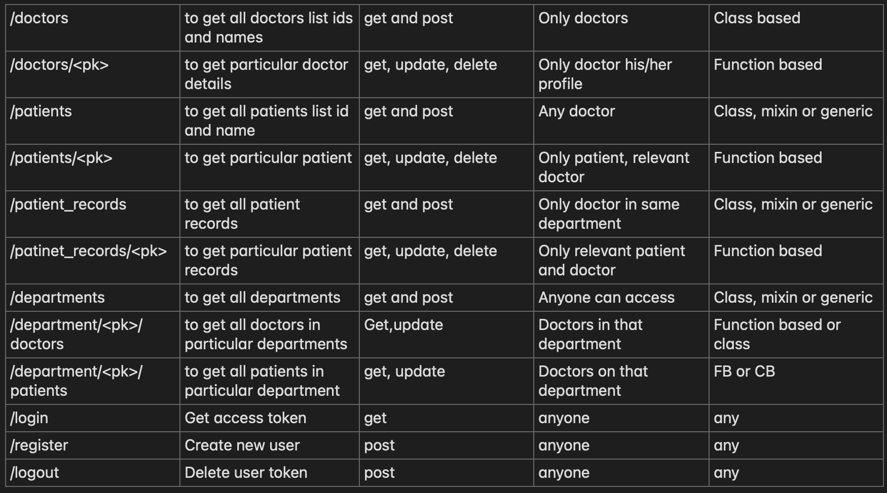

# blink doc

Hospital Software to maintain and store date of
- Doctor
- Patient
- Department  

## Patient Records Model
1. Record id
2. Patient id
3. Created date
4. Diagnostics 
5. Observations
6. Treatments
7. Department id
8. Misc

## Doctor Records Model
1. Id
2. Name
3. Department Id

## Department Records Model
1. Id
2. Name
3. Diagnostics 
4. Location
5. Specialization

# API Calls

